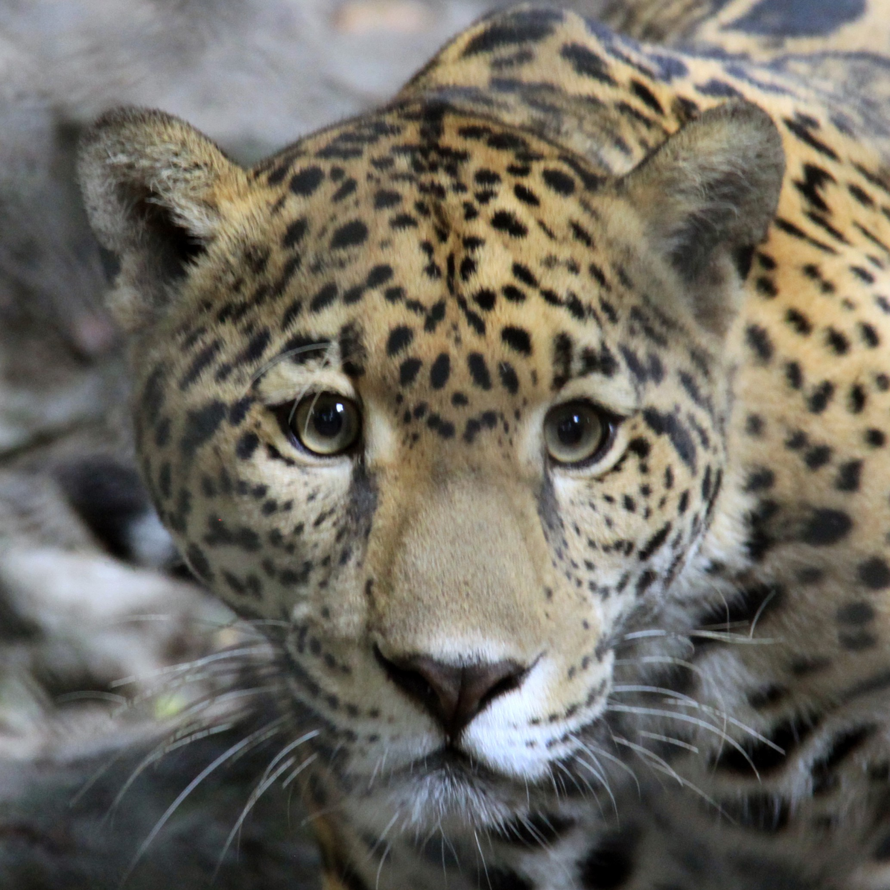
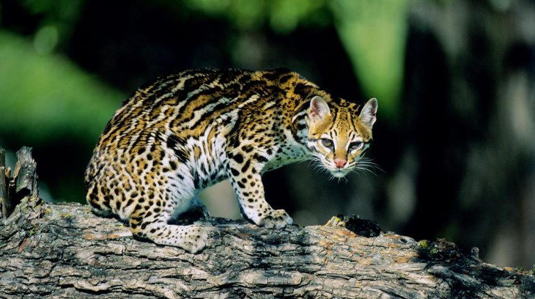
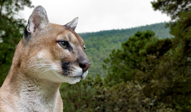

# **Distribución de especies de felinos en Costa Rica** 

# Introducción
Costa Rica es conocida por su rica biodiversidad, alberga varias especies de felinos que desempeñan un papel esencial en el equilibrio ecológico. Desde el jaguar hasta el ocelote, estos felinos se encuentran en diferentes ecosistemas del país. Sin embargo, enfrentan desafíos significativos debido a la pérdida de hábitat, la caza furtiva y otros factores antropogénicos.

Este sitio web tiene como objetivo proporcionar una visión detallada de las especies de felinos presentes en Costa Rica, sus distribuciones, los desafíos de conservación que enfrentan, y cómo los datos geoespaciales pueden ayudar en su protección.

### Especies a tratar:
##### ___Tabla #1___

|   Nombre de  la Especie   | Nombre cientifico    | 
|:-------------------------:|:--------------------:|
| Jaguar                    |  (_Panthera onca_)   |
| Ocelote                   |(_Leopardus pardalis_)|
| Puma                      |  (_Puma concolor_)   |

## Descripción general de las especies

* **Jaguar _(Panthera onca)_**

Imagen de [Procuraduria Federal de Proteccion al Ambiente ](https://www.gob.mx/cms/uploads/image/file/578083/Jaguar.jpg)

El [jaguar](https://www.nationalgeographicla.com/animales/2020/04/jaguar) es el felino más grande de América y el tercero más grande del mundo, después de los tigres y los leones. En la actualidad solo se encuentra en el 33% de su distribución original.
&nbsp;

Se caracteriza por ser un depredador oportunista, y mayoritariamente nocturno. Su alimentación  incluye mamíferos, aves, peces, reptiles, anfibios e invertebrados. 
&nbsp;

Son solitarios y territoriales por lo que los machos y hembras viven apartados y solo se reúnen durante el apareamiento (Galindo-Leal, 2009).

#### Hábitat y Distribución Geográfica

El jaguar se encuentra en áreas protegidas como el Parque Nacional Corcovado y el Parque Nacional Tortuguero, donde se preservan los ecosistemas de selva tropical.
&nbsp;

Más especificamente, "habita en bosques tropicales densos, bosques lluviosos y espinosos, bosques de montaña, de pino-encino, tropicales perennifolios, caducifolios y subcaducifolios, así como zonas pantanosas y manglares" e incluso zonas con cierto grado de perturbación (PFPA, 2020).

#### Amenazas y Estado de Conservación

La fragmentación de su hábitat y la caza ilegal son amenazas críticas, lo que lo posiciona en un estado de vulnerabilidad.
&nbsp;

Según  Redacción National Geographic
(2021), en cuanto a la fragmentación, esta se debe a altas tasas de deforestación para tierras de pastoreo, agricultura y otros usos. Lo que provoca mayor aislamiento entre los jaguares y esto se traduce en mayor dificultad para encontrar pareja y eventualmente reproducirse.
&nbsp;

Por su parte, la caza furtiva también constituye otro problema grave. Ya que los jaguares desde años atrás han sido cazados para obtener sus pieles y actualmente sus dientes y huesos para fines comerciales (Redacción National Geographic
2021). 

&nbsp;

* **Ocelote (_Leopardus pardalis_)**

Imagen de [NATIONAL GEOGRAPHIC](https://www.ngenespanol.com/wp-content/uploads/2022/10/ocelote-el-pequeno-tigre-de-america-que-esta-en-riesgo-770x431.jpg)

El [ocelote](https://www.ngenespanol.com/animales/ocelote-el-pequeno-tigre-de-america-que-esta-en-riesgo/) es un felino mediano conocido por su pelaje único con manchas y rayas, lo que lo hace fácilmente identificable. Aunque es solitario y nocturno, se le puede avistar en varias regiones del país. 
&nbsp;

Se caracteriza por su visión y oído. Por su agudeza, le resultan útiles al momento de cazar roedores y otros animales de tamaño menor. Cabe recalcar que actualmente está en peligro de extinción. 

Este felino es solitario y suele refugiarse en cuevas, troncos, y ramas. Al igual que los jaguares, los ocelotes solo se encuentran entre ellos para fines de reproducción ya que son muy territoriales (Milo, 2022). 

#### Hábitat y Distribución Geográfica

El ocelote habita principalmente en los bosques tropicales y subtropicales del Pacífico y el Caribe.
Además, prefiere áreas con densa vegetación donde pueda cazar pequeños mamíferos, aves, y reptiles.

Según PFPA (2020), el ocelote se desarrolla en una gran variedad de tipos de hábitat, que incluyen bosque espinoso y matorral xerófilo, y en el bosque mesófilo de montaña, selvas húmedas y secas.

#### Amenazas y Estado de Conservación

De acuerdo al PFPA (2020), "el ocelote se ubica en la categoría en Peligro de Extinción." La perdida de su habitat, la cacería ilegal, la disminución de presas y la extracción de organismo para comercializar son las principales razones del porqué esta especie se encuentra en este grado de vulnerabilidad. 

Tal como ocurre con el jaguar, la fragmentación del hábitat es determinante en la conservación del ocelote. Asimismo, la existencia de actividades agrícolas y ganaderas,  Por una parte, el desarrollo de las actividades agrícolas y ganaderas y la amenaza de la cacería furtiva afecta la disponibilidad de alimento. También se destaca el tráfico ilegal de sus productos (piel y colmillos) en el mercado negro (PFPA, 2020). 

&nbsp;

* **Puma (_Puma concolor_)**

Imagen de [Procuraduria Federal de Proteccion al Ambiente ](https://www.gob.mx/cms/uploads/press/main_image/113662/post_PUMA.jpg)

El [puma](https://www.nationalgeographicla.com/animales/puma) es un animal solitario y realiza sus actividades a partir del atardecer. A diferencia de los felinos antes mencionados. El puma es, después del jaguar, el felino de mayor tamaño en América. 

Según PFPA (2021) "Una hembra puede tener una camada cada dos años, después del apareamiento las hembras tienen en promedio 2.67 crías. En zonas templadas el promedio es de 3 crías y en zonas tropicales es de 1 cría, aunque normalmente, en la primera camada tiene sólo una cría."

Además, estos felinos no rugen, si no que emiten gruñidos, ronroneos e incluso silbídos agudos (PFPA, 2021).

#### Hábitat y Distribución Geográfica

Habita en todo tipo de vegetación del país, desde el nivel del mar, hasta 4,000 m de altitud (PFPA, 2021).

A pesar de que son animales solitarios y tímidos los pumas pueden vivir en regiones transitadas por el hombre, sin embargo es indispensable que tenagn buenos escondites como peñascos o barrancos profundos (PFPA, 2021). Lo anterior nos da una visión sobre la gran adaptibilidad de esta especie. La misma capacidad de adaptación que posee, le permite, si fuese necesario, distribuirse por diferentes ecosistemas como lo son, bosques, desiertos, selvas y montañanas nevadas (NATIONAL GEOGRAPHIC, s.f).
&nbsp;

#### Amenazas y Estado de Conservación
El puma se encuentra en una posición bastante vulnerable, ya que a pesar de adaptarse a diferentes ecosistemas, se ve constantemente desplazado por amenazas como las que menciona la PFPA (2021), las cuales son la caza furtiva para fines de tráfico ilegal y uso de piel para temas religiosos; y la destrucción de su hábitat como consecuencia de la urbanización.

## Datos Geoespaciales
##### ___Tabla #2___

|   Tipo de variable        | Utilidad             | 
|:-------------------------:|:--------------------:|
| Categórica                |  Para facilitar la identificación de felinos   |
| Descriptiva               |Descripción del felino observado|
| Ubicación                 |  Para determinar la coordenada espacial de donde se tuvo la observación   |

Los datos a utilizar, se obtendrán de fuentes que contextualicen la distribución de las especies mediante la implementación de un Survey en el cual estará la opción de reportar una nueva observación; fijando la ubicación, o bien, con los reportes existentes actualmente y de esta manera, lograr mapear la distribución de estos felinos. 
&nbsp;

## Preguntas a responder:
Con los resultados obtenidos a partir de la recolección de datos, me interesaría responder/me una serie de preguntas:

1. ¿Existen regiones específicas donde se observan con mayor frecuencia ciertas especies de felinos?
2. ¿Algunas especies de felinos muestran preferencia por ciertos hábitats (por ejemplo, áreas boscosas, pastizales)?
3. ¿Cómo afecta la presencia de actividades humanas (agricultura, urbanización) a la distribución de estas especies?
4. ¿Existen tendencias que indiquen una expansión o contracción de sus hábitats?
5. ¿Existen regiones donde los esfuerzos de conservación deberían priorizarse según la presencia de especies vulnerables?
6. ¿Hay evidencia de superposición espacial entre diferentes especies de felinos, y qué podría indicar esto sobre sus interacciones (por ejemplo, competencia, coexistencia)?
7. ¿Cómo se correlacionan factores ambientales como elevación, temperatura y tipo de vegetación con la distribución de las diferentes especies de felinos?

## Referencias bibliográficas:

1. Milo, A. (2022). Así es el ocelote, el gran ‘cazador solitario’ que domina el continente americano. _National Geographic_. [https://www.ngenespanol.com/animales/ocelote-el-pequeno-tigre-de-america-que-esta-en-riesgo/](https://www.ngenespanol.com/animales/ocelote-el-pequeno-tigre-de-america-que-esta-en-riesgo/)
2. National Geographic. (s.f). Puma. _National Geographic._ [https://www.nationalgeographicla.com/animales/puma](https://www.nationalgeographicla.com/animales/puma)
3. Procuraduria Federal de Proteccion al Ambiente. (2020). Ocelote _(Leopardus pardalis)_. _Gobierno de México_. [https://www.gob.mx/profepa/articulos/ocelote-leopardus-pardalis?idiom=es](https://www.gob.mx/profepa/articulos/ocelote-leopardus-pardalis?idiom=es)
4. Procuraduria Federal de Proteccion al Ambiente. (2020). Protección al felino más grande de América, el jaguar. _Gobierno de México_. [https://www.gob.mx/profepa/articulos/proteccion-al-felino-mas-grande-de-america-el-jaguar?idiom=es](https://www.gob.mx/profepa/articulos/proteccion-al-felino-mas-grande-de-america-el-jaguar?idiom=es)
5. Procuraduria Federal de Proteccion al Ambiente. (2021). Día internacional del puma. _Gobierno de México_. [https://www.gob.mx/profepa/articulos/dia-internacional-del-puma?idiom=es](https://www.gob.mx/profepa/articulos/dia-internacional-del-puma?idiom=es)
6. Redacción National Geographic. (2021). Jaguar. _National Geographic_. [https://www.nationalgeographicla.com/animales/2020/04/jaguar](https://www.nationalgeographicla.com/animales/2020/04/jaguar)